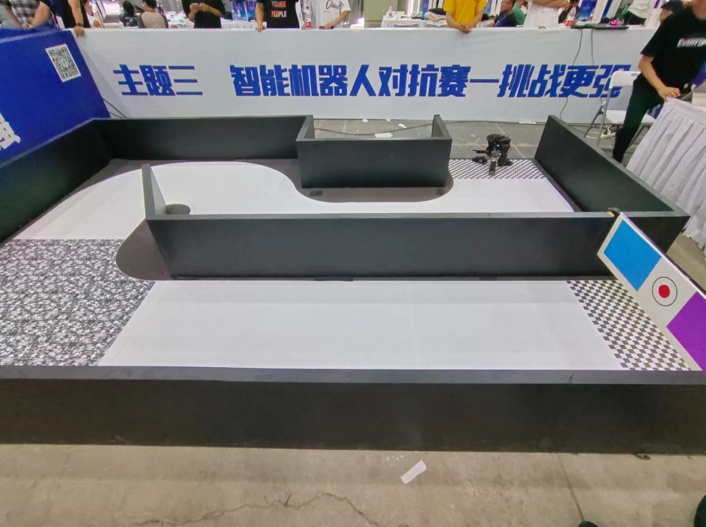
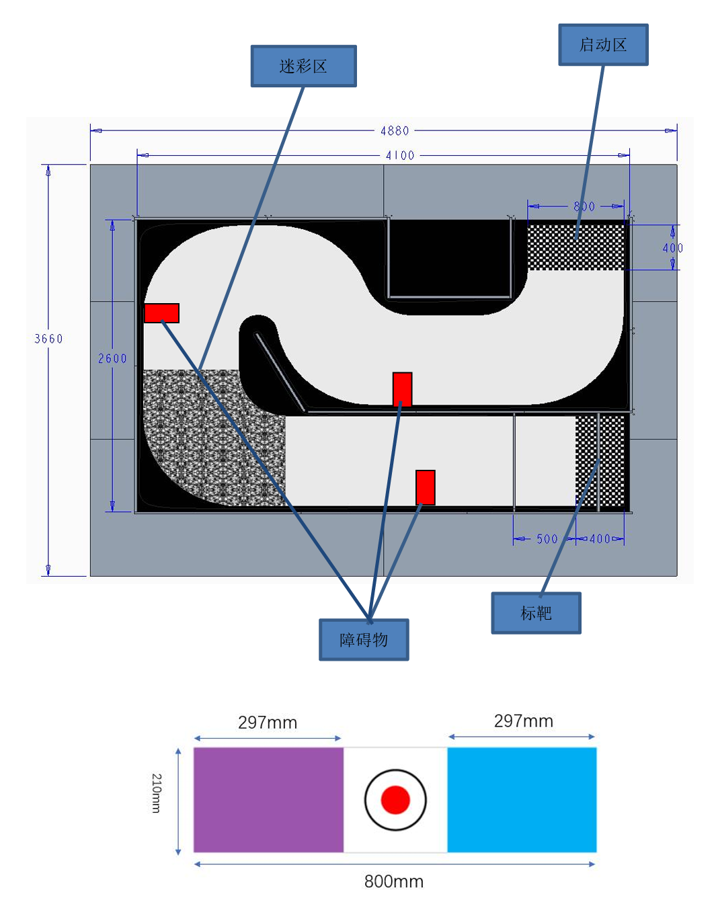
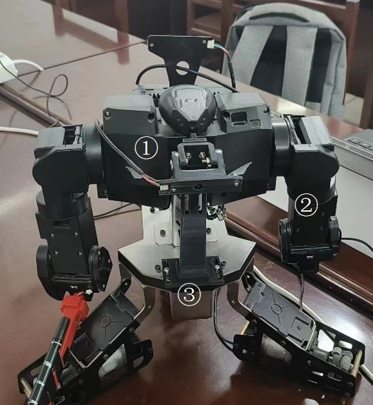

# 视觉对抗A入门指南

## 中国高校智能机器人创意大赛-统一部件组视觉对抗A-入门指南

## 1. 项目简介

---

### 1.1 赛规简述:

---

视觉对抗A项目是一个旨在提高机器人在机器视觉和运动控制方面的能力的比赛。参赛队伍需要在统一提供的机器人和相关部件上编写程序完成任务，并自行设计摄像头固定件和固定方式。比赛场地由三个部分组成：启动区，模拟公路和靶区。机器人需要从启动区出发，沿着模拟公路行驶，并避开途中的障碍物，到达停止区前的停止判定区并停下，挥动手臂完成击靶，利用图像制导和机械臂运动规划，完成对靶子的打击。比赛的评分标准分为两部分，分别为完成自动驾驶和未完成自动驾驶。

### 1.2 赛道场地图

---

实景图，来自2023年比赛现场：



规则图，来自2023年比赛规则：



### 1.3 详细规则附件(2023版)

---

[详细规则附件](README.assets/统一部件组视觉对抗A比赛规则.pdf)

## 2. 机器人介绍

---

### 2.1 机器人外观及尺寸

---

本项目统一使用的机器人为：智元素-格斗机器人-高级版，制造商为博创尚和。

简介：它可以通过编程或手机遥控来操控机器人的动作，实现对战等多种模式。它还可以通过安装树莓派背包来扩展机器人的功能。它的传感器系统也可以让机器人适应不同的环境和任务，如避障、寻迹、跟随等。

机器人的尺寸：高：31cm；长33cm；宽35cm；重量：3.475kg



### 2.2 所用功能产品介绍

---

#### 2.2.1 树莓派背包

---

本项比赛所指定的树莓派型号为Raspberry Pi 3 Model B(Rev 1.2)，硬件参数如下：

| 项目   | 参数                                                   |
|------|------------------------------------------------------|
| CPU  | Broadcom BCM2837 64 位四核 ARM Cortex-A53 处理器，频率 1.2GHz |
| GPU  | Broadcom VideoCore IV @ 400 MHz                      |
| 内存   | 1GB LPDDR2 SDRAM （实际可用874M)                          |
| 网络   | 10/100/1000M以太网口，2.4GHz 802.11n 无线局域网，蓝牙4.1          |
| GPIO | 40pin扩展接口                                            |
| 视频输出 | HDMI                                                 |
| 音频输出 | 3.5mm音频输出接口                                          |
| 存储   | Micro SD 卡插槽                                         |
| USB  | 4个USB 2.0接口                                          |
| 电源   | 通过机器人背部的串口兼电源线供应                                     |

系统镜像使用博创尚和官方提供的镜像，系统信息如下：

| 项目           | 参数                      |
|--------------|-------------------------|
| Linux发行版     | Raspbian GNU/Linux 9.13 |
| Linux发行版上游   | Debian 9.13 (stretch)   |
| Linux内核版本    | 4.19.118-v7+            |
| 系统架构         | armv7l (32位arm)         |
| 包管理器         | apt                     |
| 桌面环境         | LXDE (lxde 9+rpi1)      |
| 默认shell      | bash                    |
| python版本     | 3.5.3                   |
| TensorFlow版本 | 1.14.0                  |
| OpenCV版本     | 3.4.1                   |
| Numpy版本      | 1.18.1                  |

#### 2.2.2 摄像头

---

本项比赛所指定的摄像头为OmniVision OV2659，硬件参数如下：

| 项目        | 参数                |
|-----------|-------------------|
| 传感器型号     | OmniVision OV2659 |
| 视频捕获的像素格式 | YUYV              |
| 驱动方式      | V4L2驱动            |

运行以下命令获取摄像头支持的分辨率以及相应最大帧率:

```shell
v4l2-ctl --list-formats-ext
```

| 分辨率       | 最大帧率   |
|-----------|--------|
| 640x480   | 30 fps |
| 320x240   | 30 fps |
| 160x120   | 30 fps |
| 352x288   | 30 fps |
| 176x144   | 30 fps |
| 1280x1024 | 7 fps  |
| 1600x1200 | 5 fps  |

运行以下命令获取摄像头支持的控制参数:

```shell
v4l2-ctl -l
```

| 参数                             | 翻译      | 最小值      | 最大值     | 默认值     |
|--------------------------------|---------|----------|---------|---------|
| brightness                     | 亮度      | -64      | 64      | 4       |
| contrast                       | 对比度     | 0        | 100     | 33      |
| saturation                     | 饱和度     | 0        | 100     | 37      |
| hue                            | 色调      | -2000    | 2000    | 0       |
| white_balance_temperature_auto | 自动白平衡温度 | 0(false) | 1(true) | 1(true) |
| gamma                          | 伽马      | 100      | 300     | 100     |
| power_line_frequency           | 电源频率    | 0        | 2       | 1(50Hz) |
| white_balance_temperature      | 手动白平衡温度 | 2800     | 6500    | 4600    |
| sharpness                      | 锐度      | 0        | 15      | 2       |
| backlight_compensation         | 背光补偿    | 0        | 2       | 1       |

通过对比其他摄像头的输出，可以发现摄像头缺少对曝光的控制，在其他摄像头相应的参数如下：

| 参数                | 翻译    | 最小值 | 最大值   | 默认值 |
|-------------------|-------|-----|-------|-----|
| exposure_auto     | 自动曝光  | 0   | 3     | 3   |
| exposure_absolute | 曝光绝对值 | 1   | 10000 | 156 |

该摄像头的驱动暂不支持关闭自动曝光和调整曝光时间，摄像头在面对不同光强时会自动调整曝光时间，进而影响摄像头的帧率，面对纯黑色画面时会曝光得更亮，面对纯白色画面时会曝光得更暗，摄像头不支持控制曝光的特性对后期图像处理能力提出了更高的要求。

**摄像头参数调节命令示例:**

```shell
# 摄像头设备文件/dev/video0，关闭自动白平衡，并手动设置白平衡色温为3000K
v4l2-ctl -d /dev/video0 -c white_balance_temperature_auto=0 -c white_balance_temperature=3000
```

```shell
# 摄像头设备文件/dev/video2，亮度20，对比度55，饱和度0
v4l2-ctl -d /dev/video2 -c brightness=20 -c contrast=55 -c saturation=0
```

#### 2.2.3 机械臂

---

##### 2.2.3.1 机械臂介绍

---

机器人的机械臂由四个舵机组成，每个舵机相当于一个关节，树莓派可以利用串口电源线向机器人的微控制器发送指令，微控制器就能控制舵机来执行预配置好的动作，在本次比赛中，我们需要用机械臂来完成击靶任务，具体步骤如下：

1. 在机器人的手上安装一把武器，并在武器上固定一个记号笔，笔尖伸出武器不超过40mm。
2. 机器人开始自动驾驶前，提前调整好机械臂的姿态和方向。
3. 机器人进行自动驾驶时，机械臂需要保持不动，因为机械臂的任何动作都会被裁判判定为击靶。
4. 在停止判定区停下后，控制舵机执行动作，使记号笔在靶子上留下痕迹，完成击靶。

##### 2.2.3.2 机械臂动作编辑

---

机器人的微控制器可以存储多个动作，每个动作都有一个编号，实际可用的动作为动作1、动作2、动作3、动作4。可以使用智元素-动作编辑器软件来编辑动作。

[智元素-动作编辑器下载链接](https://wwwf.lanzout.com/iHJ8j17xs2kh)    （请根据要求安装.NET Framework）

1. 配置机器人连接到和电脑的同一个局域网，或使电脑连接到机器人提供的热点(MYAP-******)。
2. 打开智元素-动作编辑器软件，点击“连接网络”按钮，如果无法连接，选择不同的IP地址或检查网络。
3. 点击“搜索机器人”按钮，选择相应的机器人，默认使用密码88888888连接。
4. 点击“动作编辑”，双击“无.MFO”文件，此时将从机器人下载动作文件，随后可以编辑动作。
5. 编辑完毕后，点击“保存动作”按钮。

##### 2.2.3.3 机械臂动作设计

---

机械臂的动作设计需要考虑以下几个方面：

1. 机械臂的动作需要在机器人停止判定区停下后执行，因此需要在机器人自动驾驶时保持不动。
2. 机械臂的姿态和方向会对机器人的重心产生轻微影响，因此需要提前调整好机械臂的姿态和方向。
3. 击靶的动作应该尽量明显，以便裁判判定。
4. 击靶的动作应该尽量提高容错率，保证即使在停止判定区无法精确定位靶子，也尽可能将笔挥到靶子上。
5. 在2024年规则中，停止判定区处上方有一根铁杆用于裁判判定，所以要调整机械臂的姿态，确保经过停止判定区时机械臂不会碰到上方的铁杆。

##### 2.2.3.4 机械臂动作调用

以下是机械臂调用的示例:

```python
# 导入机器人控制模块
from robotPi import robotPi
# 创建机器人对象
robot = robotPi()
# 调用自带挥手动作
robot.movement.wave_hands()
```

---

wave_hands函数在robotpi_Cmd中，调用其他动作只需要复制wave_hands函数的内容，更改其中的

```
data[0] = 数字 & 0xFF
```

即可调用不同动作，不同数字调用出来的动作需要自行尝试。


#### 2.2.4 全向轮底盘

---

机器人自带的全向轮底盘由三个全向轮组成，每个全向轮由一个电机驱动，树莓派可以利用串口电源线向机器人的微控制器发送包含角度、速度、转向、时间的指令，微控制器进行解析后控制每个电机的转速，从而控制机器人的运动。

以下是机器人的运动控制的示例：

```python
# 导入机器人控制模块
from robotPi import robotPi
# 创建机器人对象
robot = robotPi()
# 机器人向前运动1秒
robot.movement.move_forward(speed=10, times=1000)
```
---

查看robotpi_movement.py可以看到还有其他的运动函数，包括原地左右转，前进左右转，停止等，这些函数都是通过调整传入cmd.Command函数的角度、速度、转向、时间四个参数达到不同的运动效果，如果机器人的运动参数更改很频繁时（比如使用PID控制转向），可以在该文件里加入带有这四个默认参数的函数，方便调用

```python
def any_ward(self, angle=0, speed=0, turn=0, times=500):
    if self.isOpen:
        command = self.cmd.Command(angle, speed, turn, times)
        self.action.write_serial(command)
        return True
    return False
```

## 3. 树莓派的使用

### 3.1 给TF卡烧录树莓派系统镜像

 博创尚和提供的树莓派系统镜像在此链接
 
 [百度网盘](https://pan.baidu.com/s/1SPbmoqwrBD53V-6ZChR70Q?pwd=grz4) 提取码grz4
 
 找到Pack_pub_vXXX.rar下载，并解压出img文件，这个img文件就是原始磁盘镜像文件，里面包含分区表、分区、文件系统和数据，通过镜像写入工具将该文件逐字节写入到TF卡里，并插入到树莓派TF卡插槽上，树莓派就能引导启动TF卡里的操作系统。
 
常用的镜像写入工具有win32 disk imager、rufus、balena etcher。写入TF卡的操作流程基本相同，都是先选择这个镜像文件，再选择要写入的TF卡，微调一些设置，最后写入镜像。

第一次开机时推荐连接显示器，观察是否能正常进入系统，进入桌面。

### 3.2 连接树莓派

连接树莓派的方式有很多，最稳定的连接方式当然是HDMI直连显示器，但是机器人本身需要在赛道上跑，并且规则不允许插入除摄像头之外的外设，所以这种方法仅适合首次连接进入桌面配置好网络，在网络配置好之后就可以断开显示器，改用远程连接的方式连接树莓派。_（2023国赛赛前真有人抱着显示器追着机器人调试）_

---

远程连接可以分为两大类：有图形界面，无图形界面。

无图形界面直接使用ssh就行。

有图形界面的协议有很多，xrdp、vnc、nx(nomachine)等。_（尝试过安装todesk，但是系统的glibc版本太低无法启动）_

#### 3.2.1 获取树莓派的IP地址

获取IP地址的前提是树莓派已连接上wifi，最直接的办法是插上键盘鼠标显示器，直接在右上角设置里连好wifi，鼠标移动到连接的网络上就能显示IP地址。

---

如果身边没有显示器，可以将烧录好的TF卡插到电脑上，TF卡的boot分区一般会自动挂载，在里面找到名为wpa_supplicant.conf文件，如果找不到，则自己创建一个，替换该文件里的内容如下

```
ctrl_interface=DIR=/var/run/wpa_supplicant GROUP=netdev
update_config=1
country=CN

network={
    ssid="wifi名称"
    psk="wifi密码"
    key_mgmt=WPA-PSK
}
```

再将TF卡插回树莓派上，因为这个配置文件的格式很容易出错，而且很容易出玄学问题，运气好的情况下，树莓派能自动连接到刚配置的wifi，运气不好只能使用其他办法。

---

这里分享一个我自己摸索出来能比较稳定配置wifi的办法，只需要一个安卓手机和一根数据线。

手机上安装好termux或MT管理器或juicessh等可以打开本地终端的软件。

将树莓派开机，并和手机用数据线连起来，手机设置里打开USB网络共享，此时手机会创建一个网络接口，名字一般为```rndis0```，进入手机上的终端软件，打开本地终端，输入命令

```
ip neigh show dev rndis0
```

此时会有输出

```
192.168.89.64 lladdr 1e:dd:29:75:35:72 REACHABLE
fe80::ce82:5430:c811:1cd3 lladdr 1e:dd:29:75:35:72 STALE
2408:8471:1010:4c32:d1c1:db91:e5b2:9626 lladdr 1e:dd:29:75:35:72 STALE
```

其中```192.168.89.64```一般就是树莓的IP地址，有了IP地址就可以在手机使用ssh或NoMachine等软件连接树莓派去配置wifi了。

#### 3.2.2 ssh方式连接树莓派

ssh可以算是性能开销最小的连接方式了，只有一个命令行界面，可以尽量腾出cpu处理图形，连接稳定性也很好。

Windows10以上系统基本都内置了openssh，打开powershell(终端)输入ssh确认是否存在ssh程序。

连接树莓派时确保本机和树莓派在同一局域网内，并且获得树莓派的IP地址，ssh命令的格式如下

```
ssh 用户名@IP地址
```

例如，要连接树莓派的用户名为pi，IP地址为```192.168.43.193```，密码为```bcsh```，则输入以下命令

```
ssh pi@192.168.43.193
```

此时会提示输入密码，输入密码时不会回显出来，直接输入bcsh回车即可。

如果登录成功，会显示用户提示符

```
pi@localhost:$
```

如果出现Connection refused，Connection timeout等，检查目标IP地址是否正确，是否和树莓派在同一局域网下。

如果出现kex_exchange_identification: Connect closed by remote host，把梯子关掉即可。

---

想免密ssh连接树莓派，可以自行搜索如何使用ssh公钥登录。

想提高ssh的使用体验，可以安装PuTTY，MobaXterm，Xshell等ssh增强工具，记录历史连接，操作文件等更方便。

#### 3.2.3 NoMachine连接树莓派

博创尚和的镜像已经默认配置好NoMachine，参考博创尚和的文档即可，此方法性能占用中等，稳定性差，画质差，优点是可以自动搜索树莓派的IP地址。

#### 3.2.4 xrdp连接树莓派

xrdp可以兼容微软远程桌面连接协议，在windows上直接使用远程桌面连接即可，此方法性能占用高，稳定性好，画质好。

在树莓派上自行配置好国内apt软件源，推荐中科大的(ustc)，输入以下命令安装xrdp

```
sudo apt update && sudo apt install xrdp
```

输入以下命令在开机时自动启动xrdp

```
sudo systemctl enable xrdp
```

在Windows上开始菜单栏搜索远程桌面连接，输入树莓派的IP地址，点击更多选项调整色彩和分辨率，然后点击连接，输入用户名和密码，OK。

---

修复xrdp登陆后黑屏的问题

打开/etc/xrdp/startwm.sh，添加以下内容

```
unset DBUS_SESSION_BUS_ADDRESS
```

然后重启