# 视觉对抗A入门篇

作者：ashkorehennessy(ashkorehennessy@gmail.com)

仓库：[github(private)](https://github.com/ashkorehennessy/visual-confrontation)

最后修改：2024-03-17

## 1. 项目简介

### 1.1 赛规简述:

官方赛规简述：视觉对抗A项目是一个旨在提高机器人在机器视觉和运动控制方面的能力的比赛。参赛队伍需要在统一提供的机器人和相关部件上编写程序完成任务，并自行设计摄像头固定件和固定方式。比赛场地由三个部分组成：启动区，模拟公路和靶区。机器人需要从启动区出发，沿着模拟公路行驶，并避开途中的障碍物，到达停止区前的停止判定区并停下，挥动手臂完成击靶，利用图像制导和机械臂运动规划，完成对靶子的打击。比赛的评分标准分为两部分，分别为完成自动驾驶和未完成自动驾驶。

### 1.2 赛道场地图

实景图，来自2023年国赛比赛现场：


规则图，来自2024年比赛规则：


### 1.3 详细规则附件(2024版)

[详细规则附件](README.assets/统一部件组视觉对抗A比赛规则.pdf)

## 2 机器人介绍

### 2.1 机器人外观及尺寸

本项目统一使用的机器人为：智元素-格斗机器人-高级版，制造商为博创尚和。

官方简介：它可以通过编程或手机遥控来操控机器人的动作，实现对战等多种模式。它还可以通过安装树莓派背包来扩展机器人的功能。它的传感器系统也可以让机器人适应不同的环境和任务，如避障、寻迹、跟随等。

机器人的尺寸：高：31cm；长33cm；宽35cm；重量：3.475kg


### 2.2 所用功能产品介绍

#### 2.2.1 树莓派背包

本项比赛所指定的树莓派型号为Raspberry Pi 3 Model B(Rev 1.2)，硬件参数如下：

| 项目   | 参数                                                   |
|------|------------------------------------------------------|
| CPU  | Broadcom BCM2837 64 位四核 ARM Cortex-A53 处理器，频率 1.2GHz |
| GPU  | Broadcom VideoCore IV @ 400 MHz                      |
| 内存   | 1GB LPDDR2 SDRAM （实际可用874M)                          |
| 网络   | 10/100/1000M以太网口，2.4GHz 802.11n 无线局域网，蓝牙4.1          |
| GPIO | 40pin扩展接口                                            |
| 视频输出 | HDMI                                                 |
| 音频输出 | 3.5mm音频输出接口                                          |
| 存储   | Micro SD 卡插槽                                         |
| USB  | 4个USB 2.0接口                                          |
| 电源   | 通过机器人背部的串口兼电源线供应                                     |

系统镜像使用博创尚和官方提供的镜像，系统信息如下：

| 项目           | 参数                      |
|--------------|-------------------------|
| Linux发行版     | Raspbian GNU/Linux 9.13 |
| Linux发行版上游   | Debian 9.13 (stretch)   |
| Linux内核版本    | 4.19.118-v7+            |
| 系统架构         | armv7l (32位arm)         |
| 包管理器         | apt                     |
| 桌面环境         | LXDE (lxde 9+rpi1)      |
| 默认shell      | bash                    |
| python版本     | 3.5.3                   |
| TensorFlow版本 | 1.14.0                  |
| OpenCV版本     | 3.4.1                   |
| Numpy版本      | 1.18.1                  |

#### 2.2.2 摄像头

本项比赛所指定的摄像头为OmniVision OV2659，硬件参数如下：

| 项目        | 参数                |
|-----------|-------------------|
| 传感器型号     | OmniVision OV2659 |
| 视频捕获的像素格式 | YUYV              |
| 驱动方式      | V4L2驱动            |

摄像头的设备路径为/dev/videoX，其中X为摄像头的编号。

运行以下命令获取摄像头支持的分辨率以及相应最大帧率:

```shell
v4l2-ctl --list-formats-ext
```

| 分辨率       | 最大帧率   |
|-----------|--------|
| 640x480   | 30 fps |
| 320x240   | 30 fps |
| 160x120   | 30 fps |
| 352x288   | 30 fps |
| 176x144   | 30 fps |
| 1280x1024 | 7 fps  |
| 1600x1200 | 5 fps  |

运行以下命令获取摄像头支持的控制参数:

```shell
v4l2-ctl -l
```

| 参数                             | 翻译      | 最小值      | 最大值     | 默认值     |
|--------------------------------|---------|----------|---------|---------|
| brightness                     | 亮度      | -64      | 64      | 4       |
| contrast                       | 对比度     | 0        | 100     | 33      |
| saturation                     | 饱和度     | 0        | 100     | 37      |
| hue                            | 色调      | -2000    | 2000    | 0       |
| white_balance_temperature_auto | 自动白平衡温度 | 0(false) | 1(true) | 1(true) |
| gamma                          | 伽马      | 100      | 300     | 100     |
| power_line_frequency           | 电源频率    | 0        | 2       | 1(50Hz) |
| white_balance_temperature      | 手动白平衡温度 | 2800     | 6500    | 4600    |
| sharpness                      | 锐度      | 0        | 15      | 2       |
| backlight_compensation         | 背光补偿    | 0        | 2       | 1       |

通过对比其他摄像头的输出，可以发现摄像头缺少对曝光的控制，在其他摄像头相应的参数如下：

| 参数                | 翻译    | 最小值 | 最大值   | 默认值 |
|-------------------|-------|-----|-------|-----|
| exposure_auto     | 自动曝光  | 0   | 3     | 3   |
| exposure_absolute | 曝光绝对值 | 1   | 10000 | 156 |

该摄像头的驱动暂不支持关闭自动曝光和调整曝光时间，摄像头在面对不同光强时会自动调整曝光时间，进而影响摄像头的帧率，面对纯黑色画面时会曝光得更亮，面对纯白色画面时会曝光得更暗，摄像头不支持控制曝光的特性对后期图像处理能力提出了更高的要求。

_(2023年国赛现场的场地亮度大约为180lux，和319教室打开所有灯光的亮度差不多，摄像头无法跑满30fps，平均只有24fps。)_

**摄像头参数调节命令示例:**

```shell
# 摄像头设备文件/dev/video0，关闭自动白平衡，并手动设置白平衡色温为3000K
v4l2-ctl -d /dev/video0 -c white_balance_temperature_auto=0 -c white_balance_temperature=3000
```

```shell
# 摄像头设备文件/dev/video2，亮度20，对比度55，饱和度0
v4l2-ctl -d /dev/video2 -c brightness=20 -c contrast=55 -c saturation=0
```

#### 2.2.3 摄像头支架（固定件）

摄像头支架推荐自己设计3D打印，可以根据自己的需求设计不同的支架，比如固定角度，固定高度，固定位置等。

#### 2.2.4 机械臂

##### 2.2.4.1 机械臂介绍

机器人的机械臂由四个舵机组成，每个舵机相当于一个关节，树莓派可以利用串口电源线向机器人的微控制器发送指令，微控制器就能控制舵机来执行预配置好的动作，在本次比赛中，我们需要用机械臂来完成击靶任务，具体步骤如下：

1. 在机器人的手上安装一把武器，并在武器上固定一个记号笔，笔尖伸出武器不超过40mm。
2. 机器人开始自动驾驶前，提前调整好机械臂的姿态和方向。
3. 机器人进行自动驾驶时，机械臂需要保持不动，因为机械臂的任何动作都会被裁判判定为击靶。
4. 在停止判定区停下后，控制舵机执行动作，使记号笔在靶子上留下痕迹，完成击靶。

##### 2.2.4.2 机械臂动作编辑

机器人的微控制器可以存储多个动作，每个动作都有一个编号，实际可用的动作为动作1、动作2、动作3、动作4。可以使用智元素-动作编辑器软件来编辑动作。

[智元素-动作编辑器下载链接](https://wwwf.lanzout.com/iHJ8j17xs2kh)    （请根据要求安装.NET Framework）

1. 配置机器人连接到和电脑的同一个局域网，或使电脑连接到机器人提供的热点(MYAP-******)。
2. 打开智元素-动作编辑器软件，点击“连接网络”按钮，如果无法连接，选择不同的IP地址或检查网络。
3. 点击“搜索机器人”按钮，选择相应的机器人，默认使用密码88888888连接。
4. 点击“动作编辑”，双击“无.MFO”文件，此时将从机器人下载动作文件，随后可以编辑动作。
5. 编辑完毕后，点击“保存动作”按钮。

##### 2.2.4.3 机械臂动作设计

机械臂的动作设计需要考虑以下几个方面：

1. 机械臂的动作需要在机器人停止判定区停下后执行，因此需要在机器人自动驾驶时保持不动。
2. 机械臂的姿态和方向会对机器人的重心产生轻微影响，因此需要提前调整好机械臂的姿态和方向。
3. 击靶的动作应该尽量明显，以便裁判判定。
4. 击靶的动作应该尽量提高容错率，保证即使在停止判定区无法精确定位靶子，也尽可能将笔挥到靶子上。
5. 在2024年规则中，停止判定区处上方有一根铁杆用于裁判判定，所以要调整机械臂的姿态，确保经过停止判定区时机械臂不会碰到上方的铁杆。

##### 2.2.4.4 机械臂动作调用

以下是机械臂调用的示例:

```python
# 导入机器人控制模块
from robotPi import robotPi
# 创建机器人对象
robot = robotPi()
# 调用自带挥手动作
robot.movement.wave_hands()
```

---

wave_hands函数在robotpi_Cmd中，调用其他动作只需要复制wave_hands函数的内容，更改其中的

```
data[0] = 数字 & 0xFF
```

即可调用不同动作，不同数字调用出来的动作需要自行尝试。


#### 2.2.5 全向轮底盘

机器人自带的全向轮底盘由三个全向轮组成，每个全向轮由一个电机驱动，树莓派可以利用串口电源线向机器人的微控制器发送包含角度、速度、转向、时间的指令，微控制器进行解析后控制每个电机的转速，从而控制机器人的运动。

以下是机器人的运动控制的示例：

```python
# 导入机器人控制模块
from robotPi import robotPi
# 创建机器人对象
robot = robotPi()
# 机器人向前运动1秒
robot.movement.move_forward(speed=10, times=1000)
```
---

查看robotPi_movement.py可以看到还有其他的运动函数，包括原地左右转，前进左右转，停止等，这些函数都是通过调整传入cmd.Command函数的角度、速度、转向、时间四个参数达到不同的运动效果，如果机器人的运动参数更改很频繁时（比如使用PID控制转向），可以在该文件里加入带有这四个默认参数的函数，方便调用

```python
def any_ward(self, angle=0, speed=0, turn=0, times=500):
    if self.isOpen:
        command = self.cmd.Command(angle, speed, turn, times)
        self.action.write_serial(command)
        return True
    return False
```

## 3 树莓派的使用

### 3.1 给TF卡烧录树莓派系统镜像

博创尚和提供的树莓派系统镜像在此链接
 
[百度网盘](https://pan.baidu.com/s/1SPbmoqwrBD53V-6ZChR70Q?pwd=grz4) 提取码grz4
 
找到Pack_pub_vXXX.rar下载，并解压出img文件，这个img文件就是原始磁盘镜像文件，里面包含分区表、分区、文件系统和数据，通过镜像写入工具将该文件逐字节写入到TF卡里，并插入到树莓派TF卡插槽上，树莓派就能引导启动TF卡里的操作系统。
 
常用的镜像写入工具有win32 disk imager、rufus、balena etcher。写入TF卡的操作流程基本相同，都是先选择这个镜像文件，再选择要写入的TF卡，微调一些设置，最后写入镜像。

第一次开机时推荐连接显示器，观察是否能正常进入系统，进入桌面。

如果不能进入桌面，可以尝试重新烧录镜像。

### 3.2 连接树莓派

连接树莓派的方式有很多，最稳定的连接方式当然是HDMI直连显示器，但是机器人本身需要在赛道上跑，并且规则不允许插入除摄像头之外的外设，所以这种方法仅适合首次连接进入桌面配置好网络，在网络配置好之后就可以断开显示器，改用远程连接的方式连接树莓派。_（2023国赛赛前真有人抱着显示器追着机器人调试）_

---

远程连接可以分为两大类：有图形界面，无图形界面。

无图形界面直接使用ssh就行。

有图形界面的协议有很多，xrdp、vnc、nx(nomachine)等。_（尝试过安装todesk，但是系统的glibc版本太低无法启动）_

#### 3.2.1 获取树莓派的IP地址

获取IP地址的前提是树莓派已连接上wifi，最直接的办法是插上键盘鼠标显示器，直接在右上角设置里连好wifi，鼠标移动到连接的网络上就能显示IP地址。

或者打开终端，使用ifconfig命令查看树莓派的IP地址

```shell
ifconfig
```

找到wlan0的inet地址，这个地址就是树莓派的IP地址。

---

如果身边没有显示器，可以将烧录好的TF卡插到电脑上，TF卡的boot分区一般会自动挂载，在里面找到名为wpa_supplicant.conf文件，如果找不到，则自己创建一个，替换该文件里的内容如下

```
ctrl_interface=DIR=/var/run/wpa_supplicant GROUP=netdev
update_config=1
country=CN

network={
    ssid="wifi名称"
    psk="wifi密码"
    key_mgmt=WPA-PSK
}
```

再将TF卡插回树莓派上，因为这个配置文件的格式很容易出错，而且很容易出玄学问题，运气好的情况下，树莓派能自动连接到刚配置的wifi，运气不好只能使用其他办法。

---

这里分享一个我自己摸索出来能比较稳定配置wifi的办法，只需要一个安卓手机和一根数据线。

手机上安装好termux或MT管理器或juicessh等可以打开本地终端的软件。

将树莓派开机，并和手机用数据线连起来，手机设置里打开USB网络共享，此时手机会创建一个网络接口，名字一般为```rndis0```，进入手机上的终端软件，打开本地终端，输入命令

```
ip neigh show dev rndis0
```

此时会有输出

```
192.168.89.64 lladdr 1e:dd:29:75:35:72 REACHABLE
fe80::ce82:5430:c811:1cd3 lladdr 1e:dd:29:75:35:72 STALE
2408:8471:1010:4c32:d1c1:db91:e5b2:9626 lladdr 1e:dd:29:75:35:72 STALE
```

其中```192.168.89.64```一般就是树莓的IP地址，有了IP地址就可以在手机使用ssh或NoMachine等软件连接树莓派去配置wifi了。

手机上也有相应的Microsoft远程桌面，vncviewer，nomachine等软件，可以直接在手机上连接树莓派。

#### 3.2.2 ssh方式连接树莓派

ssh是使用最基础最广泛的连接方式，也是性能开销最小的连接方式，只有一个命令行界面，可以尽量腾出cpu处理图形，连接稳定性很好。

Windows10以上系统基本都内置了openssh，打开powershell(终端)输入ssh确认是否存在ssh程序。

连接树莓派时确保本机和树莓派在同一局域网内，并且获得树莓派的IP地址，ssh命令的格式如下

```
ssh 用户名@IP地址
```

例如，要连接树莓派的用户名为pi，IP地址为```192.168.43.193```，密码为```bcsh```，则输入以下命令

```
ssh pi@192.168.43.193
```

此时会提示输入密码，输入密码时不会回显出来，直接输入bcsh回车即可。

如果登录成功，会显示用户提示符

```
pi@localhost:$
```

如果出现Connection refused，Connection timeout等，检查目标IP地址是否正确，是否和树莓派在同一局域网下。

如果出现kex_exchange_identification: Connect closed by remote host，把梯子关掉即可。

---

想免密ssh连接树莓派，可以自行搜索如何使用ssh公钥登录。

想提高ssh的使用体验，可以安装PuTTY，MobaXterm，Xshell等ssh增强工具，记录历史连接，操作文件等更方便。

#### 3.2.3 NoMachine连接树莓派

博创尚和的镜像已经默认配置好NoMachine，参考博创尚和的文档即可，此方法性能占用中等，稳定性差，画质差，优点是可以自动搜索树莓派的IP地址。

#### 3.2.4 xrdp连接树莓派

xrdp可以兼容微软远程桌面连接协议，在windows上直接使用远程桌面连接即可，此方法性能占用高，稳定性好，画质好。

输入以下命令安装xrdp

```
sudo apt update && sudo apt install xrdp
```

输入以下命令在开机时自动启动xrdp

```
sudo systemctl enable xrdp
```

在Windows上开始菜单栏搜索远程桌面连接，输入树莓派的IP地址，点击更多选项调整色彩和分辨率，然后点击连接，输入用户名和密码，OK。

---

修复xrdp登陆后黑屏的问题

打开/etc/xrdp/startwm.sh，找到```test -x /etc/X11/Xsession && exec /etc/X11/Xsession```这一行，在前面另起一行添加以下内容

```
unset DBUS_SESSION_BUS_ADDRESS
unset XDG_RUNTIME_DIR
```

然后重启

#### 3.2.5 vnc连接树莓派

vnc连接可以参考此[文档](README.assets/人工智能控制器组件包技术文档20220416.docx)，大致流程为先ssh连接树莓派，然后运行vncserver，然后在本地使用vncviewer连接树莓派。

由于vncserver没有相应的systemd服务，要让vncserver在开机时自动启动，可以修改rc.local文件，输入以下命令

```
sudo nano /etc/rc.local
```

找到```exit 0```，在其上面添加以下内容

```
su - pi -c '/usr/bin/vncserver'
```

然后按 ```Ctrl+X``` ，输入 ```Y``` ，再按 ```Enter``` 保存退出，这样vncserver就会在开机时自动启动。

此方法性能占用中等，稳定性中等，画质中等。

### 3.3 树莓派的额外配置

#### 3.3.1 修改镜像源

树莓派默认的镜像源是raspbian，国内访问速度很慢，可以修改为中科大或其他国内镜像源。

打开终端，输入以下命令

```
sudo nano /etc/apt/sources.list
```

在打开的文件中，使用方向键移动光标，将所有的```http://raspbian.raspberrypi.org/raspbian/``` 替换为 ```http://mirrors.ustc.edu.cn/raspbian/raspbian/``` ，然后按 ```Ctrl+X``` ，输入 ```Y``` ，再按 ```Enter``` 保存退出。

再修改这个文件

```
sudo nano /etc/apt/sources.list.d/raspi.list
```

在打开的文件中，使用方向键移动光标，将所有的```http://archive.raspberrypi.org/debian/``` 替换为 ```http://mirrors.ustc.edu.cn/archive.raspberrypi.org/debian/``` ，然后按 ```Ctrl+X``` ，输入 ```Y``` ，再按 ```Enter``` 保存退出。

输入以下命令更新软件包列表

```
sudo apt update
```

#### 3.3.2 安装软件

apt是树莓派的包管理器，可以安装大部分软件。

输入以下命令搜索软件

```
apt search 软件名
```

此时会列出所有包含软件名的软件，找到自己需要的软件名，然后输入以下命令安装软件

```
sudo apt install 软件名
```

#### 3.3.3 关闭sudo密码

编辑/etc/sudoers文件，输入以下命令

```
sudo nano /etc/sudoers
```

在打开的文件中，找到```%sudo   ALL=(ALL:ALL) ALL```，修改为

```
%sudo   ALL=(ALL:ALL) NOPASSWD: ALL
```

然后按 ```Ctrl+X``` ，输入 ```Y``` ，再按 ```Enter``` 保存退出。

这样就可以在不输入密码的情况下使用sudo命令了。

#### 3.3.4 v4l2ucp介绍

v4l2ucp是一个图形化实时调节摄像头参数的软件，可以调节亮度、对比度、饱和度、色调等参数。

输入以下命令安装v4l2ucp

```
sudo apt install v4l2ucp
```

然后可以在应用列表里找到v4l2ucp，打开后选择摄像头设备，调节参数即可。

调节参数时最好打开摄像头预览，可以编写一个简单的python脚本配合opencv来实现

```python
import cv2

cap = cv2.VideoCapture(0)

while True:
    ret, frame = cap.read()
    cv2.imshow('frame', frame)
    if cv2.waitKey(1) & 0xFF == ord('q'):
        break

cap.release()

cv2.destroyAllWindows()
```

#### 3.3.5 摄像头松动处理

机器人行驶过程中，摄像头的USB接口有可能会震动松动，导致摄像头断开连接，由于摄像头使用v4l2驱动，所以摄像头断开连接后会导致/dev/video0设备文件消失，此时需要重新插拔摄像头或者输入以下命令重新加载v4l2驱动

```shell
sudo modprobe -r uvcvideo
sudo modprobe uvcvideo
```

在运行python脚本并且使用opencv打开摄像头时，可以使用以下方法检测摄像头断开连接，并尝试重新加载v4l2驱动

```python
import cv2
import subprocess
import time
video = cv2.VideoCapture('/dev/video0')
while True:
    ret, video_image = video.read()
    if ret is False:
        video.release()
        time.sleep(0.1)
        print("reconnect to camera")
        subprocess.check_call("sudo modprobe -rf uvcvideo", shell=True)
        time.sleep(0.4)
        subprocess.check_call("sudo modprobe uvcvideo", shell=True)
        time.sleep(0.2)
        video = cv2.VideoCapture('/dev/video0')
```

---

当然，提前预防摄像头USB口松动才是最稳妥的办法，一个简单好用的办法是用软锤子把摄像头的USB接口敲到稍扁，这样摄像头就不会轻易松动了。

#### 3.3.5 树莓派文件传输

树莓派本身性能比较差，不适合在树莓派上编写大量代码，只更改代码的几个参数还好，自带的thonny功能太简单，vscode远程连接树莓派开发也是非常卡顿，所以建议在本地编写代码，然后传输到树莓派上跑。

传输文件的方式有很多，最简单的是使用scp命令，scp是ssh的一个子命令，可以在本地和远程主机之间传输文件。

scp的命令格式如下

```
scp 本地文件路径 用户名@IP地址:远程文件路径
```

比如，要将本地的```C:\Users\a123\auto\04.03.AutoDrive_tensorflow.py```文件传输到树莓派的```/home/pi/Downloads/auto```目录下，树莓派的IP地址为192.168.43.193，输入以下命令

```
scp C:\Users\a123\auto\04.03.AutoDrive_tensorflow.py pi@192.168.43.193:/home/pi/Downloads/auto
```

此时会提示输入密码，输入密码后文件就会传输到树莓派上。

如果要传输整个文件夹，可以使用```-r```参数

```
scp -r C:\Users\a123\auto pi@192.168.43.193:/home/pi/Downloads
```

一些ssh工具也自带文件传输功能，比如MobaXterm，Xshell等。

---

可以直接插U盘，然后在树莓派上用文件管理器复制粘贴，但是对U盘的格式有要求，一般是FAT32格式，NTFS格式的U盘只能读不能写。

如果电脑上安装了Linux实体机，可以直接挂载读写TF卡中的数据。

## 4 完成任务

### 4.1 代码功能简介

完成任务用到的代码位于```/home/pi/Downloads/auto``` ，只需使用部分文件。

#### 4.1.1 robotPi.py

给robotPi_movement.py套了一层皮。

#### 4.1.2 robotPi_movement.py

定义了控制机器人的函数，包括底盘运动、机械臂动作、播放音乐。_(看起来还可以直接控制机械臂关节的转角，但是没成功运行过)_

#### 4.1.3 robotPi_Cmd.py

接受来自robotPi_movement.py传入的参数，并转换为控制指令通过串口发送到机器人的控制器。

#### 4.1.4 04.00.Collect_offline.py

采集不同区域图片并归类用于训练，默认分有7个类别，每次最高采集100张图片，运行该脚本后会打开一个预览画面，按下相应按键时会截取当前图像并归类，按q采集结束后会以numpy矩阵格式压缩(.npz)存储到dataset目录下。

#### 4.1.5 04.01.Train_model_tensorflow.py

使用tensorflow训练采集到的图片，当准确率大于某个设定的值时，将权重文件存储到model/auto_drive_model目录下，并结束训练退出。_(可以试着修改脚本让训练完后自动重新开始训练，用预测精度命名权重文件来区分权重文件的好坏，全自动炼丹)_

#### 4.1.6 04.02.Train_model_opencv.py

没用过此方案，可以自行尝试。

#### 4.1.7 04.03.AutoDrive_tensorflow.py

使用tensorflow对摄像头图片实时预测分类实现机器人自动驾驶，是完成任务的核心文件，一般也是修改最频繁的文件，流程为加载tensorflow，从model/auto_drive_model读取指定的权重文件，打开摄像头在大循环里获取实时图像，使用tensorflow进行预测，通过预测结果让机器人做出相应行为或动作。

#### 4.1.7 04.05.AutoDrive_opencv.py

没用过此方案，可以自行尝试。

### 4.2 任务大体思路

**提个醒，tensorflow不能处理或者处理效果不好的，可以尝试手搓图像处理算法来弥补，没有必要拘泥于tensorflow，规则也没说一定要用tensorflow。**

#### 4.2.1 采集图片数据

采集图片要采集灰度图，不要二值化图像。

采集图片时推荐每一轮只采集一个类别的图片，如果想采集某个类别超过100张的再采集一轮就行。

采集好图片后最好及时给图片重命名，比如turn_left1.npz，turn_right2.npz之类，到时在赛道上跑的时候哪组数据预测得不好，直接重新采集这组数据再训练就行。

采集图片时要尽可能避免脏数据，如果在左转图片组中混进来一张停止图片，就会污染训练后的模型，使预测精度大幅下降，遇到这种情况最好重新采集，不然后面会耗费更多不必要的时间在这里。

#### 4.2.2 训练模型

训练模型需要配置好tensorflow环境，官方提供代码里的模型训练脚本是基于tensorflow1.x的，如果是tensorflow2.x版本的话，需要自行修改代码。

训练前将采集好的图片数据放到dataset目录下，运行04.01.Train_model_tensorflow.py，训练过程中会打印出预测精度，当预测精度大于某个设定的值时，将权重文件存储到model/auto_drive_model目录下，并结束训练退出。

为了加速模型训练过程，我们需要使用支持CUDA的N卡，目前绝大部分N卡都支持CUDA，其中16系以上的型号配备了Tensor Cores，能更快地进行训练。以下操作请确保网络畅通。

注意：NVIDIA RTX 30系以上的显卡只支持cuda11.0+的版本，而tensorflow1.x官方已经不再维护，并没有支持cuda11.0+，所以只能在Linux下安装由NVIDIA维护的tensorflow1以支持较新的显卡，参考下文。

---

**Windows环境下搭建**

确保安装了最新版本的NVIDIA显卡驱动，驱动下载[地址](https://www.nvidia.cn/Download/index.aspx?lang=cn)，选择自己显卡的型号下载。

我们使用Anaconda3作为环境管理工具，打开[官网](https://www.anaconda.com/download)，点击Download下载安装包并运行，一路点击Next直到完成安装。

打开PyCharm，新建项目，选择纯Python，在Python解释器一栏中选择使用Conda新建环境，Python版本选择3.6，点击创建。

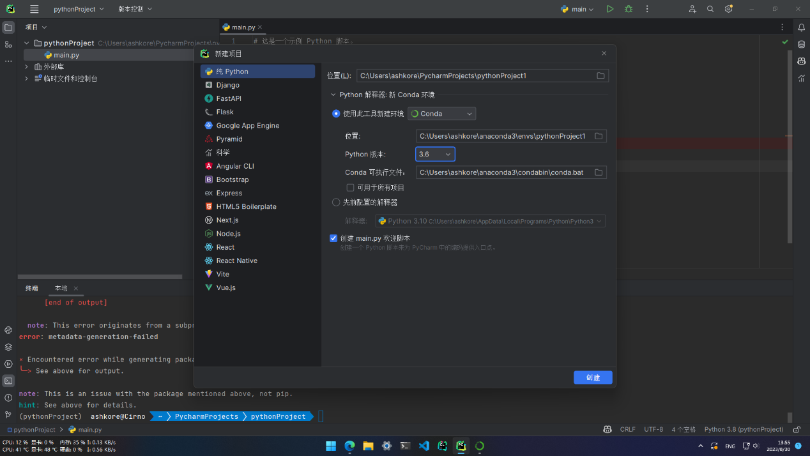

在PyCharm左下角打开Python软件包，搜索tensorflow，首先安装tensorflow-estimator、版本1.15.1，再安装tensorflow、版本1.15.0，最后效果如下。

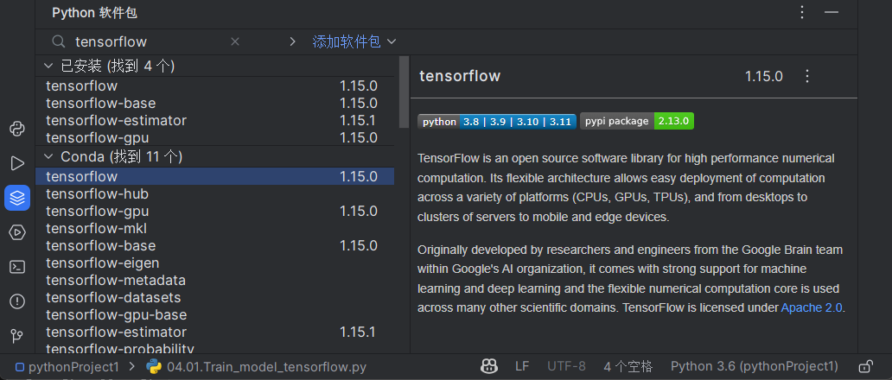

至此环境已经搭建完毕。

运行04.01.Train_model_tensorflow.py

效果如下，GPU正常参与训练过程

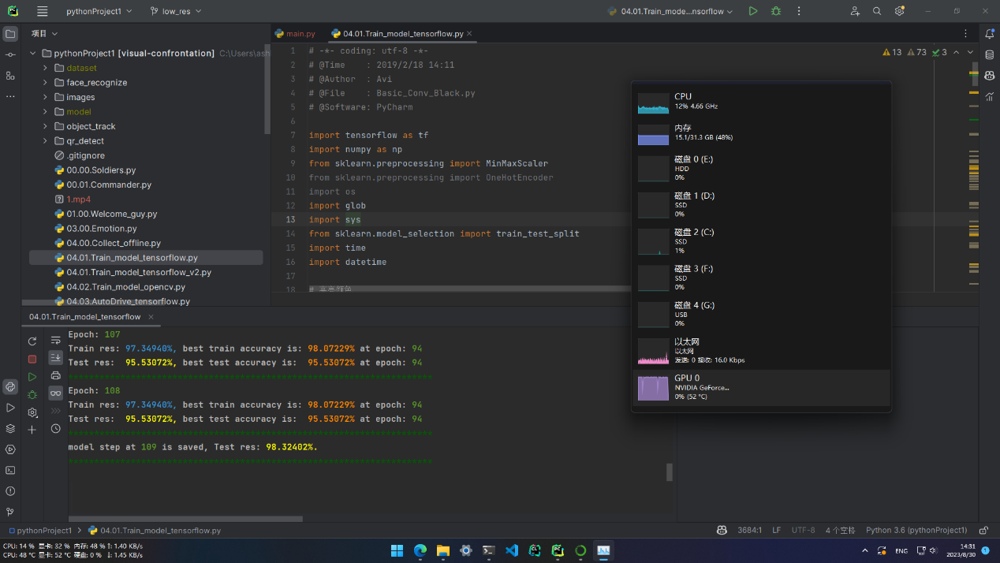

---

**在Windows下创建Linux子系统（WSL2）并部署环境**

此方案适合NVIDIA RTX 30系以上的显卡，WSL2需要Windows版本不低于Windows 10 1903，按下Win+R输入winver可以查看当前系统版本。

WSL2基于Hyper-V，可以轻松地在Windows上将GPU直通到Linux虚拟机内部进行科学计算和深度学习。

首先按下Win+X，打开powershell(管理员) 或 终端(管理员)

输入以下命令启用虚拟机监控器

```
bcdedit /set hypervisorlaunchtype auto
```


按下Win+R输入control打开控制面板，导航到控制面板\程序\程序和功能，点击启用或关闭Windows功能，勾选Hyper-V、Windows虚拟机监控程序平台、适用于Linux的Windows子系统、虚拟机平台，点击确定，等待操作完成并重启电脑。

重启完毕后按下Win+X，打开powershell(管理员) 或 终端(管理员)，输入以下命令更新WSL内核。

```
wsl -–update
```

输入以下命令将WSL默认版本设置为2。

```
wsl --set-default-version 2
```

打开微软商店（Microsoft Store），搜索Ubuntu，安装Ubuntu 20.04 LTS，安装完毕后打开。以下是正常打开效果。

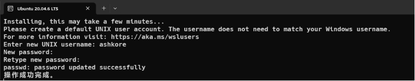

安装完毕后根据指引新建用户，输入用户名，密码和确认密码完成新建用户，注意输入的密码不会显示出来。以下是进入终端的界面。

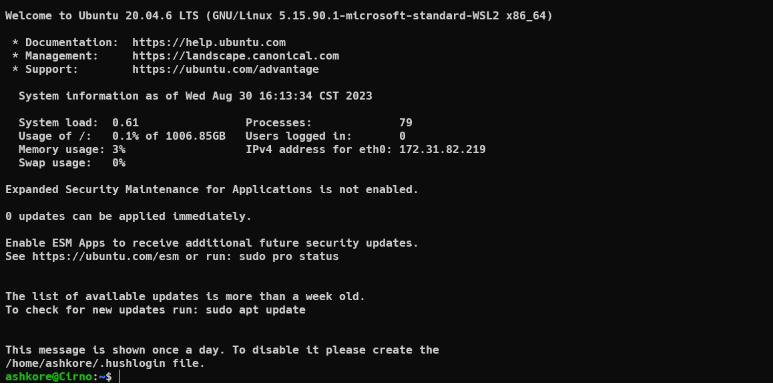

终端输入nvidia-smi验证NVIDIA显卡是否正常加载。

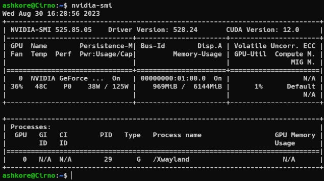

安装Anaconda3，在终端输入以下命令下载安装包，选用的版本为2023.07，可以自己选择更新版本。

```
wget https://repo.anaconda.com/archive/Anaconda3-2023.07-2-Linux-x86_64.sh
```

下载完毕后输入bash Anaconda3-2023.07-2-Linux-x86_64.sh运行安装脚本，根据指引按下回车。

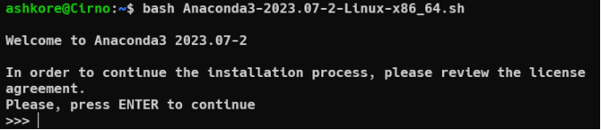

当出现EULA协议内容时，按下q可以直接退出阅读，输入yes同意EULA协议，按下回车使用默认安装位置，等待安装完毕，输入yes允许初始化anaconda3。安装完毕界面如下。

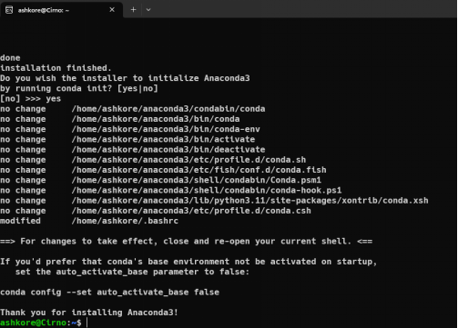

按要求关闭终端，并重新打开，此时用户名前会出现conda的环境提示符。

使用以下命令创建一个Python版本为3.8的虚拟环境。

```
conda create --name tf1 python=3.8
```

使用以下命令激活名为tf1的虚拟环境。

```
conda activate tf1
```

安装NVIDIA的Python软件包索引。

```
pip install nvidia-pyindex
```

安装scikit-learn

```
pip install scikit-learn
```

英特尔cpu用户可以安装优化版本scikit-learn-intelex

```
pip install scikit-learn-intelex
```

安装由NVIDIA维护的tensorflow1.x

因为软件包体积较大，为防止网络波动造成安装失败，建议先下载到本地再进行安装，如果中途下载失败，重新运行命令。

```
pip download nvidia-tensorflow
```

安装当前目录下后缀为whl的Python软件包

```
pip install *.whl
```

安装完成显示如下。


在文件资源管理器左下角找到Linux一栏，将相关代码复制到WSL里(Linux\Ubuntu-20.04\home\用户名\)

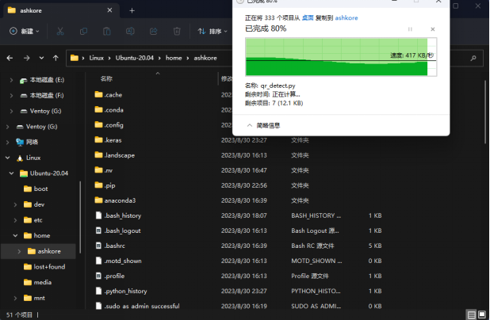

进入目录，运行训练脚本。

```
cd auto
python3 04.01.Train_model_tensorflow.py
```

显示效果如下，GPU正常参与训练过程。

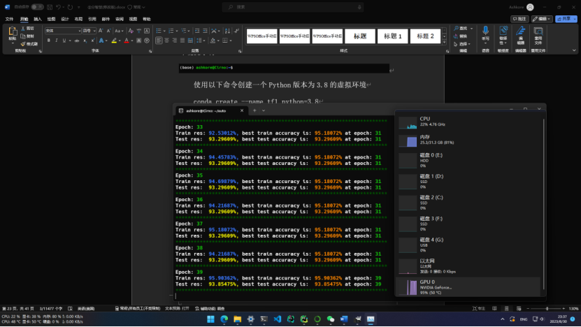

---

**在Linux实体机下部署环境**

首先安装NVIDIA闭源显卡驱动，不同发行版的Linux安装方法不同，可以自行搜索。

根据情况需要再安装CUDA和cuDNN，这两个软件包的安装方法也因发行版不同而不同，可以自行搜索。

剩下的步骤和在Windows下创建Linux子系统（WSL2）并部署环境一样。


#### 4.2.3 启动区

采集图像时可以同时把启动区左右转和正常公路左右转一起采集，可以用来让机器人在启动区矫正方向。

启动区机器人会随机指定启动方向，而且机器人不一定会放置在正中间。一般做法是使用time模块计时，在X秒内，机器人根据图片预测结果仅转向，不向前走，最好为实际机器人进行启动方向矫正耗时的最大值。

方向调整前:

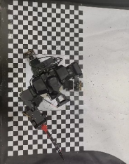

方向调整后:


#### 4.2.4 公路区

采集时推荐使用公路区前进，公路区左转，公路区右转三个分类，采集左转右转时要让机器人从不同方向、不同距离采集，提高数据的健壮性。

公路区就根据图片预测结果同时前进或转弯，由慢到快逐渐提速，充分利用机器人移动函数的四个参数，速度配合转向可以边前进边转弯，配合角度可以实现类似漂移的效果。

公路区直走就是一片白

公路区左转:


公路区右转:


#### 4.2.5 迷彩区

采集时推荐使用迷彩区前进，迷彩区左转，迷彩区右转三个分类，由于实际机器人快速经过迷彩区时镜头并不能拍到迷彩区的清晰图像，所以采集时可以一边移动机器人让图像稍微模糊并采集，实际效果会更好。

迷彩区依然是根据图片预测结果前进或转弯，可以依靠一些图像处理方法来提高图片预测的准确率，比如模糊，二值化后开闭运算处理辅助判断转向等。

迷彩区左转:

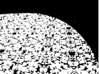

迷彩区右转:

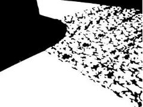

迷彩区直走:

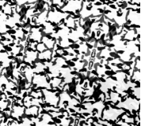

#### 4.2.6 直道

直道指迷彩区后停止区前的那段直道，判断驶出迷彩区后在直道中加速，同时把转向值减小，可以尽可能提高速度。

#### 4.2.7 停止判定区

停止判定区就是停止区棋盘前50厘米的区域，机器人完成打靶后需要在这块50厘米的区域内停下，轮子不能碰到停止区棋盘。

采集图片时用不同角度对着停止区棋盘采集即可，当机器人驶入停止判定区时摄像头画面应该为停止区棋盘，此时通过预测结果让机器人停下来，如果机器人没有完全进入停止判定区，可以使用time中的延时。

停止判定区:


#### 4.2.8 打靶

打靶算是最难的一个环节，在黑色圆内留下痕迹就算20分，不是红色圆内。调整位置的同时还得小心翼翼控制机器人前轮不要压到停止区。

打靶的位置调整在停止判定区内，一般会开启后背的摄像头来定位靶子，办法之一是裁剪掉上下部分多余的图片，将图像二值化，此时图像中靶子左右两边会变黑，中心会变白，通过计算求出靶子中心的坐标，将这个坐标与预设的目标值作差，得出的结果来控制机器人向左或向右调整。

打靶的动作需要自行设计，较流行的动作有从肩后向前挥，还有从左上往右下划，总之都是尽可能地将机械臂伸长，让记号笔留下的痕迹更长。

以右手打靶为例

需要向左调整:


调整完毕:


#### 4.2.9 障碍物

障碍物是2024年新加入的元素，放置在路边，形状是一个黑色长方体，可以当作道路的延伸，机器人需要避开障碍物。

在采集时可以将障碍物随机放置在路边，然后让机器人从不同方向、不同距离采集，提高数据的健壮性。

更好的处理方式需要自行探索。

### 4.3 提升技巧

#### 4.3.1 性能优化

树莓派跑图像处理很显然是性能不足的，此时可以导入多进程库，将图像作为共享变量，一个进程读取图像，一个进程处理图像，提高CPU的利用率，实现更低延迟。

为什么不用多线程？因为python有全局解释器锁(GIL)，一个python进程只能同时运行一个解释器，此时python多线程只能不断切换任务来模拟，实际只能占用一个CPU，所以得使用多进程才能利用到多个CPU。

---

要完成自动驾驶的任务并不需要640*480那么大的分辨率，实际上160*120都绰绰有余，更小的图像必然能处理得更快，延迟也更低，延迟下去了机器人速度才能起来。

如果要采用160*120的分辨率，需要更改从采集-训练-预测这些环节的代码。如果使用低分辨率重新训练模型后出现异常的预测结果，可以尝试更改训练代码中的所有ksize参数。

---

官方的摄像头支架是反的，得使用rev_cam()函数来180度翻转摄像头画面，完全可以用cv2.flip()翻转画面垂直和水平方向各一次来实现，性能更好，或者直接在自己设计摄像头支架时就把摄像头翻转180度，连代码都省了。

---

要分析代码的性能，可以使用cProfile模块，把要运行的代码放在main()函数里，然后运行以下代码并将分析结果保存到1.pstat文件

```python
import cProfile
cProfile.run('main()', '1.pstat')
```

将这个文件从树莓派传回电脑，使用pycharm输入快捷键```Ctrl+Alt+W```，选择1.pstat文件，就能看到图形化的代码性能分析结果。

#### 4.3.2 其他技巧

要快速验证刚训练的模型是否没有大问题，可以直接在电脑上打开电脑的摄像头，或者把闲置的摄像头连接到电脑，用黑桌垫和白纸等模拟赛道，稍微修改一下04.03.AutoDrive_tensorflow.py的代码，去掉机器人运动的相关代码，就能在电脑上实时预测摄像头的画面，这样就能快速验证模型的效果。

也可以在手机上安装IP摄像头，然后和电脑连接同一个局域网，手机打开IP摄像头，电脑端直接使用```cv2.VideoCapture('http://手机IP地址:4747/video')```即可访问手机摄像头。

---

如果在采集数据时不想让机器人移动，可以在机器人移动的代码前加上注释。

---

可以添加代码让保存机器人看到的图像，之后就可以一帧一帧地看机器人是怎么看到赛道的，方便调试。
